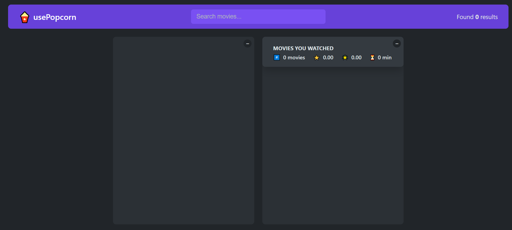
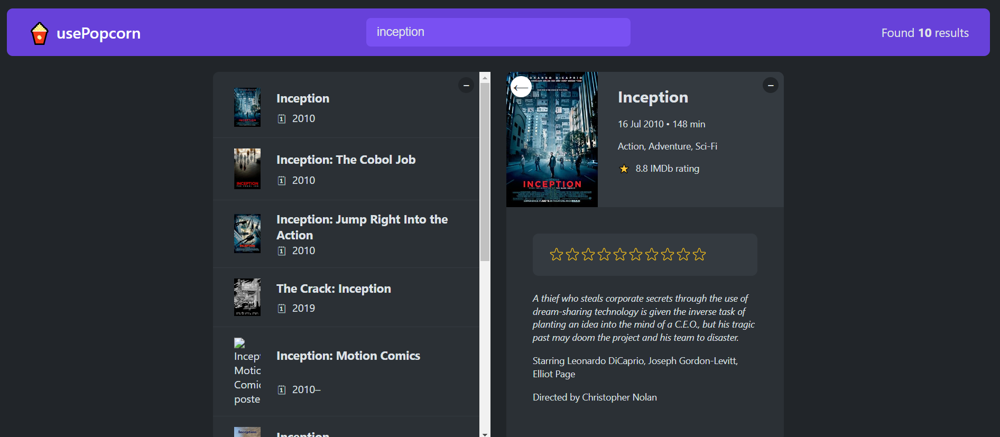
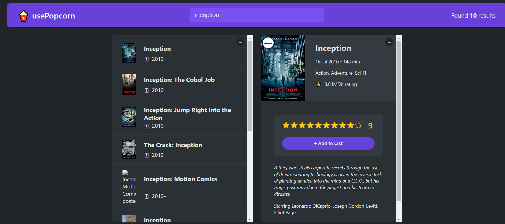
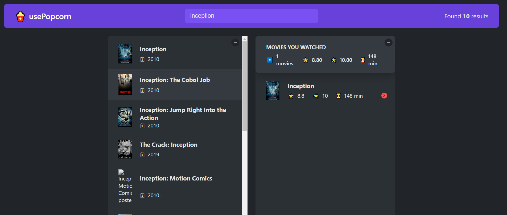
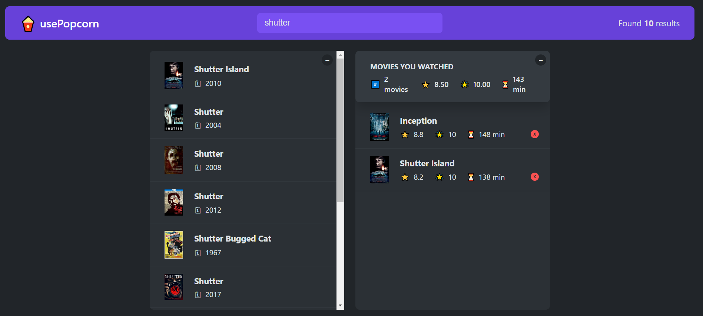
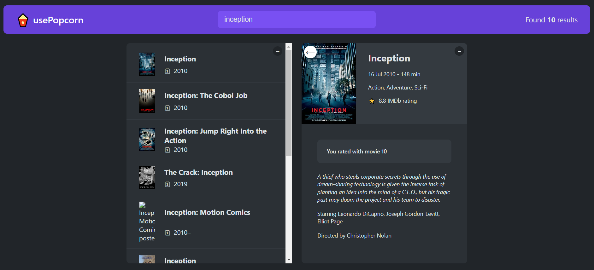
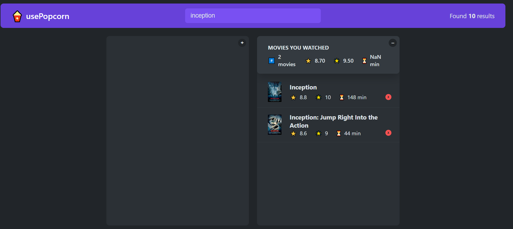

## usePopcorn

usePopcorn is my first big react project website which the user search the movies according to a written word. When the user clicks a movie on list, The movie details information will be displayed. After you can vote this movie, the Add to List button will be shown. If you want to add this movie in your watchlist you can click this button. Then the movie will be added to watchlist and it will effect Movies You Watched section. You can delete the movie from the watchlist by clicking the red x button in the watchlist. The list will be updated immediately after any change to movilist. If you want to see the movie after you voted the film, you can check your vote. If you want to leave the movie details page you can click "Esc" button or the left arrow on the poster. You can also close the search result or watchlist by clicling the minus button 🎊 .You can try by clicking <strong>[usePopcorn](https://use-popcorn-gldn.netlify.app/)</strong>.

## Technologies Used

- HTML
- CSS
- React.js(useState, useEffect, useRef)
- OMDb API

 

   
   
 
   
   
 
   
   
 
   
   
 
   
   
 
   
   
 
   
   
 
